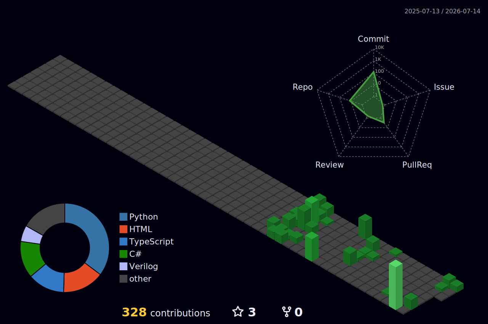
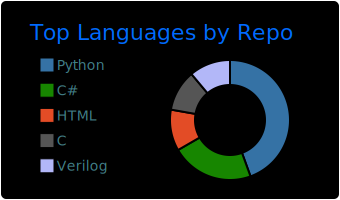
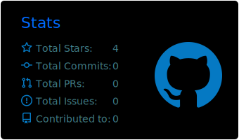

<h1 align="center">WJH-makers</h1>

  CS 本科　│　遥感视觉问答 · MoE 预训练 · 多智能体路由　│　兼修 编译器 / OS / 全栈

  <i>能复现　·　能测试　·　能上线　·　能讲清楚</i>

  <a href="https://wwjjhh.online">🌐 学习博客</a>　·　<a href="mailto:136443811+WJH-makers@users.noreply.github.com">📧 GitHub noreply</a>　·　<a href="https://github.com/WJH-makers?tab=repositories">📦 全部仓库</a>

---

### 🧭 在做

| 轨道 | 详情 |
|:--|:--|
| 🛰️ 遥感 VQA（毕设） | Next.js + FastAPI + PyTorch，端到端视觉问答 |
| 🧠 AI / MoE | RingMOE 大规模预训练 · 可学习路由 · 多智能体 |
| ⚙️ 系统 | 编译器 · xv6 内核 · 5 级流水线 CPU · FPGA |
| 🌐 全栈 | Docker · CI/CD · [学习博客](https://wwjjhh.online) |

---

### 📊 贡献 · 3D

  

---

### 🗂️ 项目 · 按方向

<!-- 下面的表格由脚本自动生成，请勿手改（改 config/profile.yml 或各仓库 description/topics） -->
<!-- AUTO:PROJECTS:START -->
**🧠 AI · 研究**　遥感 VQA · MoE 预训练 · 多智能体

| 项目 | 技术栈 | 练到的能力 |
|---|---|---|
| [RingMOE](https://github.com/WJH-makers/RingMOE) | Python | 大规模遥感预训练、并行训练、实验工程化 |
| [router-mvp](https://github.com/WJH-makers/router-mvp) | Python | 多智能体通信、可学习路由、研究型 MVP |

**⚙️ 系统 · 底层**　编译器 · 操作系统 · 体系结构

| 项目 | 技术栈 | 练到的能力 |
|---|---|---|
| [compiler-C-PLUS-PLUS](https://github.com/WJH-makers/compiler-C-PLUS-PLUS) | Python · c plus plus · compiler | 编译器前端、AST、语义分析、中间表示 |
| [xv6-riscv-riscv](https://github.com/WJH-makers/xv6-riscv-riscv) | C | OS 内核、系统调用、内存 / 进程 / 文件系统 |
| [project4](https://github.com/WJH-makers/project4) | Verilog | 5 级流水线 CPU、数据冒险、FPGA 综合验证 |

**🌐 全栈 · Web**　Next.js · FastAPI · ASP.NET · Spring

| 项目 | 技术栈 | 练到的能力 |
|---|---|---|
| [wjh-makers-learning-blog](https://github.com/WJH-makers/wjh-makers-learning-blog) · [↗](https://wjh-makers-learning-blog.vercel.app) | TypeScript · blog · learning journal · nextjs | 全栈博客、知识库、Vercel 部署 |
| [FileManagementTool](https://github.com/WJH-makers/FileManagementTool) | C# | Web 后端、文件处理、策略模式、Docker 化 |
| [mysql](https://github.com/WJH-makers/mysql) | Java | JDBC、SQL、后端基础 |

**🔧 工具 · 生态**　工具链 · 编辑器主题 · 工程模板

| 项目 | 技术栈 | 练到的能力 |
|---|---|---|
| [AIProxyHub](https://github.com/WJH-makers/AIProxyHub) | HTML | Windows 工具链整合、脚本自动化、打包发布 |
| [FTP](https://github.com/WJH-makers/FTP) | C# | 网络编程、断点续传、客户端 / 服务端协议 |
| [typora-theme-claude-like](https://github.com/WJH-makers/typora-theme-claude-like) | CSS · cjk · claude · light theme | 主题工程、双脚本字体、Mermaid 友好 |
| [readme-template](https://github.com/WJH-makers/readme-template) | documentation · github actions · github template · project template | 工程化模板、README / CI 最佳实践 |

本区块由 <code>scripts/generate_profile_readme.py</code> 依公开仓库 API + <code>config/profile.yml</code> 自动生成 · 新仓库写好 description / topics 并在 config 里归组即可入表。
<!-- AUTO:PROJECTS:END -->

<a href="https://github.com/WJH-makers?tab=repositories">→ 全部仓库</a>

---

### 📈 数据一览

  
  

---

### 🧰 技术栈

  
  
  
  
  
  
  

  
  
  
  
  
  

  
  
  
  

另含 MindSpore · DeepSpeed · CUDA · Verilog · RISC-V 等（无官方彩色图标，详见上方项目表）

---

### 🕒 最近动态

<!-- AUTO:RECENT:START -->
- **[wjh-makers-learning-blog](https://github.com/WJH-makers/wjh-makers-learning-blog)**　`2026-07-22` — 个人学习成果博客：记录 Java 全栈、Git、MySQL、AI 与工程配置复盘，部署到 Vercel
- **[typora-theme-claude-like](https://github.com/WJH-makers/typora-theme-claude-like)**　`2026-07-19` — Typora theme: Claude-like warm cream paper, dual-script fonts, Mermaid-ready (v37/v38)
- **[mysql](https://github.com/WJH-makers/mysql)**　`2026-07-19` — Java / MySQL 课程与练习项目
- **[readme-template](https://github.com/WJH-makers/readme-template)**　`2026-07-05` — README.md template for new projects — 2026 best practices
- **[AIProxyHub](https://github.com/WJH-makers/AIProxyHub)**　`2026-07-04` — AIProxyHub（二次修改版）：Windows 一键整合 CLIProxyAPI + 注册 + 本地面板 + 透明网关缓存池，并可打包为 EXE/安装包。
- **[FTP](https://github.com/WJH-makers/FTP)**　`2026-07-04` — FTP client-server with resume (断点续传) support - C# WinForms + C WinSock
<!-- AUTO:RECENT:END -->

---

### 🐍 贡献 · 贪吃蛇

  <picture>
    <source media="(prefers-color-scheme: dark)" srcset="https://raw.githubusercontent.com/WJH-makers/WJH-makers/output/github-contribution-grid-snake-dark.svg">
    <source media="(prefers-color-scheme: light)" srcset="https://raw.githubusercontent.com/WJH-makers/WJH-makers/output/github-contribution-grid-snake.svg">
    
  </picture>

---

  📧 <a href="mailto:136443811+WJH-makers@users.noreply.github.com">GitHub noreply</a>　·　🌐 <a href="https://wwjjhh.online">wwjjhh.online</a>

<!-- AUTO:META:START -->
🤖 项目 / 语言 / 动态由 GitHub Actions 依公开仓库自动同步 · 公开非 fork 仓库 <b>16</b> 个 · 项目表展示 <b>12</b> 个 · 语言分布：Python×4, C#×2, C×1, CSS×1, HTML×1, Java×1, TypeScript×1, Verilog×1
<!-- AUTO:META:END -->
