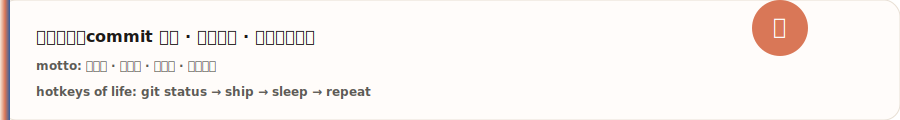

<!--
  WJH-makers Profile README · Claude Ember edition
  AUTO blocks are regenerated by scripts/generate_profile_readme.py
-->

<!-- decorative header -->
<p align="center">
  
</p>

<p align="center">
  
</p>

<p align="center">
  
</p>

<!-- badge row -->
<p align="center">
  <a href="https://wwjjhh.online"></a>
  <a href="mailto:wjh19@whu.edu.cn"></a>
  <a href="https://github.com/WJH-makers?tab=repositories"></a>
  <a href="https://github.com/WJH-makers/wjh-makers-learning-blog"></a>
  
</p>

<p align="center">
  
  
  
  
  
</p>

---

## 🗞️ 今日头版 · About

<table>
<tr>
<td width="62%" valign="top">

### 你好，我是 **万佳泓 / WJH-makers**

武汉大学 · 计算机科学与技术（2022–2026）

我喜欢把 **AI · 系统 · 全栈 · 硬件** 拧成一条链路：

```text
idea → train/serve → API → UI → deploy → 复盘文档
```

座右铭（也是 CI 门禁心态）：

> **能复现 · 能测试 · 能上线 · 能讲清楚**

| 轨道 | 正在玩什么 |
|:----:|:-----------|
| 🛰️ | 毕设：高分辨率遥感 **VQA** 全栈 + 推理链路 |
| 🤖 | MoE · 可学习路由 · 多智能体 · PyTorch / MindSpore |
| ⚙️ | 编译器 · xv6 · 五级流水线 CPU（Vivado/FPGA） |
| 🧰 | Docker · Nginx · GitHub Actions · 学习博客 · Typora 主题 |

<p>
  🌐 <a href="https://wwjjhh.online"><b>wwjjhh.online</b></a>　
  📝 <a href="https://github.com/WJH-makers/wjh-makers-learning-blog">learning-blog</a>　
  🎨 <a href="https://github.com/WJH-makers/typora-theme-claude-like">claude-like theme</a>
</p>

</td>
<td width="38%" valign="top">

### 🎮 Player Card

```text
┌─ WJH-makers ─────────────┐
│ Class   : Builder        │
│ Main    : RS-VQA / AI    │
│ Spec    : Systems+Web    │
│ Buff    : Learning daily │
│ Debuff  : Too many TODOs │
│ Quest   : Ship something │
└──────────────────────────┘
```

**Now Playing 🎧**

- 🔭 毕设 VQA 迭代  
- 📰 工程日报持续出版  
- 🎨 Claude Like 主题 v38  
- ☁️ 腾讯云自托管 + COS 备份  

**Random loot**

- ☕ 咖啡 → commit  
- 🐛 bug → 复盘卡片  
- 🚀 deploy → 睡觉  

</td>
</tr>
</table>

<p align="center">
  
</p>

> 🔒 私有仓库只抽象成公开经验（RSVQA、博客、运维），**不**在 README 暴露密钥/内网。  
> ⚙️ 项目表 **自动同步**：仓库写好 description/topics → Actions 更新（[PROFILE-AUTOMATION](docs/PROFILE-AUTOMATION.md)）。

---

## 🗺️ 冒险地图 · Experience

<table>
  <tr>
    <td width="50%" valign="top">

### 🛰️ AI / 遥感 / VQA
- 毕业设计：高分辨率遥感视觉问答  
- Next.js + FastAPI + PyTorch 一体化  
- 模型服务 · 数据流 · Docker 化部署  

### ⚙️ 系统 / 编译器 / 硬件
- [compiler-C-PLUS-PLUS](https://github.com/WJH-makers/compiler-C-PLUS-PLUS) 前端全链路  
- [xv6-riscv-riscv](https://github.com/WJH-makers/xv6-riscv-riscv) 进程/内存/FS  
- [project4](https://github.com/WJH-makers/project4) 流水线 + 冒险 + FPGA  

    </td>
    <td width="50%" valign="top">

### 🤖 大模型 / 多智能体
- [RingMOE](https://github.com/WJH-makers/RingMOE) 遥感 MoE 预训练  
- [router-mvp](https://github.com/WJH-makers/router-mvp) 可学习路由 vs 固定拓扑  
- 可复现实验 · 训练/推理效率  

### 🌐 全栈 / 工具 / 站点
- [learning-blog](https://github.com/WJH-makers/wjh-makers-learning-blog) 学习日志  
- [FileManagementTool](https://github.com/WJH-makers/FileManagementTool) ASP.NET · 策略模式  
- [claude-like](https://github.com/WJH-makers/typora-theme-claude-like) 奶油纸 Typora 主题  

    </td>
  </tr>
</table>

---

## 🏆 成就墙 · Fun Facts

| 🏅 | 解锁条件 | 状态 |
|:--:|:---------|:----:|
| 🛰️ Remote Seer | 做过遥感 + VQA 链路 | ✅ |
| 🧠 MoE Wrangler | 大模型/MoE 相关仓库 | ✅ |
| 🧱 Kernel Tourist | xv6 / OS 实践 | ✅ |
| ⚡ Pipeline Pilot | 流水线 CPU + FPGA | ✅ |
| 📰 Gazette Editor | 自托管学习博客 | ✅ |
| 🎨 Theme Alchemist | 公开 Typora 主题 | ✅ |
| 🤖 CI Bard | 工程化模板 + Actions | ✅ |
| ☁️ Cloud Hermit | 自建站 + 备份 | ✅ |

<details>
<summary><b>🎲 点击展开：我的奇怪工作流</b></summary>

<br/>

1. 先写 **能跑的最小路径**，再补漂亮  
2. 命令进博客 / 笔记，未来的自己会感谢现在的自己  
3. 主题、字体、Mermaid 会较真（是的，我测过 40 种图）  
4. 私有业务不展示；公开的尽量 **可复现**  
5. `git status` 是人生第一性原理  

</details>

---

## 🧪 精选项目 · Gallery

<!-- AUTO:PROJECTS:START -->
| 项目 | 技术 | 说明 / 练到的能力 |
|---|---|---|
| [RingMOE](https://github.com/WJH-makers/RingMOE) | Python | 大规模遥感预训练、并行训练、实验工程化 |
| [router-mvp](https://github.com/WJH-makers/router-mvp) | Python | 多智能体通信、可学习路由、研究型 MVP |
| [wjh-makers-learning-blog](https://github.com/WJH-makers/wjh-makers-learning-blog) · [site](https://wjh-makers-learning-blog.vercel.app) | TypeScript · blog · learning journal · nextjs | 个人知识库、博客系统、Vercel/自托管部署 |
| [typora-theme-claude-like](https://github.com/WJH-makers/typora-theme-claude-like) | CSS | 主题工程、双脚本字体、Mermaid 友好 |
| [compiler-C-PLUS-PLUS](https://github.com/WJH-makers/compiler-C-PLUS-PLUS) | Python · c plus plus · compiler | 编译器前端、AST、语义分析、中间表示 |
| [xv6-riscv-riscv](https://github.com/WJH-makers/xv6-riscv-riscv) | C | OS 内核、系统调用、内存/进程/文件系统 |
| [project4](https://github.com/WJH-makers/project4) | Verilog | 5 级流水线 CPU、数据冒险、FPGA 综合验证 |
| [FileManagementTool](https://github.com/WJH-makers/FileManagementTool) | C# | Web 后端、文件处理、策略模式、Docker 化 |
| [FTP](https://github.com/WJH-makers/FTP) | C# | 网络编程、断点续传、客户端/服务端协议 |
| [AIProxyHub](https://github.com/WJH-makers/AIProxyHub) | HTML | Windows 工具链整合、脚本自动化、打包发布 |
| [readme-template](https://github.com/WJH-makers/readme-template) | documentation · github actions · github template · project template | 工程化模板、README/CI 最佳实践 |
| [mysql](https://github.com/WJH-makers/mysql) | Java | JDBC、SQL、后端基础 |

<sub>本表由 <code>scripts/generate_profile_readme.py</code> 根据公开仓库 API + <code>config/profile.yml</code> 自动生成。新仓库写好 description/topics 即可入表。</sub>
<!-- AUTO:PROJECTS:END -->

---

## 🛠️ 技能树 · Stack

<p align="center">
  
</p>

```text
Languages   Python · TypeScript · Java · C/C# · C++ · Verilog · SQL · Shell
AI          PyTorch · MindSpore · DeepSpeed · Transformers · RS-VQA
Frontend    Next.js · React · TypeScript · CSS
Backend     FastAPI · ASP.NET Core · Spring/Java · REST · Docker
Systems     xv6 · RISC-V · Compiler · FPGA CPU · Vivado
Tooling     Git · Actions · SSH · Nginx · PowerShell · MySQL · Neovim · Typora
```

<!--
  Official github-readme-stats.vercel.app often returns 503 / rate-limit.
  Use community mirrors + cache_seconds so GitHub Camo can fetch SVG.
-->
<p align="center">
  <a href="https://github.com/WJH-makers?tab=repositories">
    
  </a>
  <a href="https://github.com/WJH-makers">
    
  </a>
</p>

---

## 📊 动态看板 · Live Charts

<p align="center">
  
</p>

<p align="center">
  
  
</p>

<p align="center">
  
</p>

<p align="center">
  
</p>

---

## 🐍 贪吃蛇还在卷 · Contribution Snake

<picture>
  <source media="(prefers-color-scheme: dark)" srcset="https://raw.githubusercontent.com/WJH-makers/WJH-makers/output/github-contribution-grid-snake-dark.svg" />
  <source media="(prefers-color-scheme: light)" srcset="https://raw.githubusercontent.com/WJH-makers/WJH-makers/output/github-contribution-grid-snake.svg" />
  
</picture>

<p align="center"><i>snake eats commits · i eat bugs · we both level up</i></p>

---

## 🧰 工程化装备库

| 层级 | 仓库 | 用途 |
|------|------|------|
| 🏠 主页 | [WJH-makers/WJH-makers](https://github.com/WJH-makers/WJH-makers) | 作品地图 · 自动同步 · 动态图 |
| 📋 默认模板 | [WJH-makers/.github](https://github.com/WJH-makers/.github) | Issue/PR/安全策略/工作流 |
| 🧱 新项目模板 | [readme-template](https://github.com/WJH-makers/readme-template) | README · CI · Dependabot |
| 🎨 编辑主题 | [typora-theme-claude-like](https://github.com/WJH-makers/typora-theme-claude-like) | Claude 气质 Typora |

- 安全基线：**不**公开 `.env`、token、私钥、数据库 URI  
- 手册：[GITHUB-PLAYBOOK](docs/GITHUB-PLAYBOOK.md) · [PROFILE-AUTOMATION](docs/PROFILE-AUTOMATION.md)

---

## ✍️ 最近动态 · Radar

<!-- AUTO:RECENT:START -->
- **[typora-theme-claude-like](https://github.com/WJH-makers/typora-theme-claude-like)** · `2026-07-18` — Typora theme: Claude-like warm cream paper, dual-script fonts, Mermaid-ready (v37/v38)
- **[wjh-makers-learning-blog](https://github.com/WJH-makers/wjh-makers-learning-blog)** · `2026-07-16` — 个人学习成果博客：记录 Java 全栈、Git、MySQL、AI 与工程配置复盘，部署到 Vercel
- **[readme-template](https://github.com/WJH-makers/readme-template)** · `2026-07-05` — README.md template for new projects — 2026 best practices
- **[mysql](https://github.com/WJH-makers/mysql)** · `2026-07-04` — 这是我的java项目
- **[AIProxyHub](https://github.com/WJH-makers/AIProxyHub)** · `2026-07-04` — AIProxyHub（二次修改版）：Windows 一键整合 CLIProxyAPI + 注册 + 本地面板 + 透明网关缓存池，并可打包为 EXE/安装包。
- **[FTP](https://github.com/WJH-makers/FTP)** · `2026-07-04` — FTP client-server with resume (断点续传) support - C# WinForms + C WinSock
<!-- AUTO:RECENT:END -->

### 正在建设的传送门

| 入口 | 一句话 |
|------|--------|
| [📰 学习日报](https://wwjjhh.online) | 每天把命令与踩坑印成报纸 |
| [🎨 Claude Like](https://github.com/WJH-makers/typora-theme-claude-like) | 奶油纸 · 双脚本 · Mermaid |
| [☕ Java 轨道](https://github.com/WJH-makers/mysql) | 校招基础与练习持续沉淀 |

<p align="center">
  <a href="https://wwjjhh.online"></a>
  <a href="https://github.com/WJH-makers/wjh-makers-learning-blog"></a>
  <a href="https://github.com/WJH-makers?tab=repositories"></a>
</p>

<!-- AUTO:META:START -->
<sub>自动同步 · 2026-07-19 03:59 UTC · 公开非 fork 仓库 **16** 个 · 表内展示 **12** 个 · 语言分布：Python×4, C#×2, C×1, CSS×1, HTML×1, Java×1, TypeScript×1, Verilog×1</sub>
<!-- AUTO:META:END -->

---

## 🤝 连接

如果你也在做 **遥感 / VQA / 系统 / 全栈**，欢迎来 repo 里丢 issue 或 star——  
**认真做工程的人，值得互相点个赞。**

<p align="center">
  
</p>

<p align="center">
  
</p>
